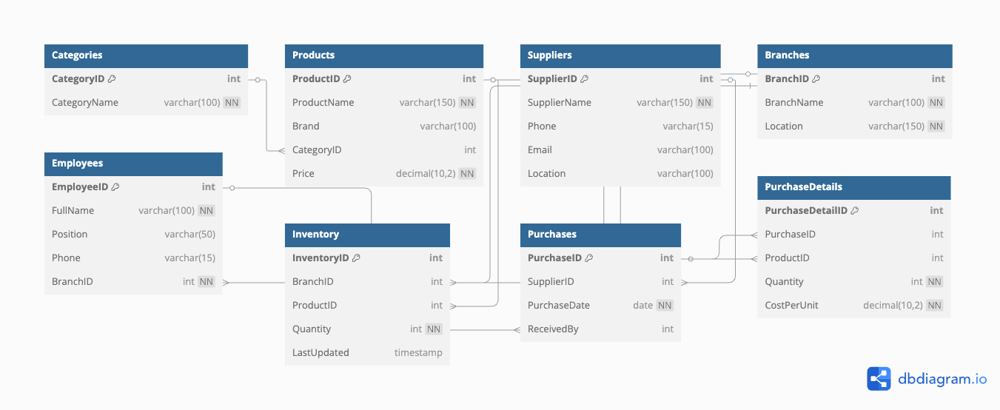

# Naivas Inventory Management System

## 📦 Description

The **Naivas Inventory Management System** is a relational database designed to streamline inventory tracking, product categorization, supplier coordination, employee management, and stock purchasing across multiple branches of the Naivas supermarket chain in Kenya. It supports efficient stock control, vendor accountability, and reporting across diverse product categories.

This database system includes the following key features:

* Product categorization and brand tracking
* Supplier management with contact and location information
* Inventory tracking by product and branch
* Employee assignment to specific branches
* Purchase tracking with supplier and receiver details
* Purchase detail tracking for cost and quantity
* ERD-based schema design ensuring referential integrity

## 🚀 How to Set Up the Project

To run or import this project into your MySQL environment:

### Step 1: Install MySQL

Make sure MySQL Server is installed on your system (e.g., MySQL Workbench, XAMPP, or Docker with a MySQL container).

### Step 2: Create the Database

Open your SQL environment and run the script provided (`naivas_inventory.sql`). It will:

* Create a database called `NaivasInventoryDB`
* Define all 8 normalized tables with appropriate foreign key relationships
* Insert sample data for testing and demonstration

```sql
-- Load script in your MySQL client
SOURCE path/to/naivas_inventory.sql;
```

### Step 3: View the Schema

Refer to the PNG image `Naivas_ERD.png` to understand the table relationships and keys.

## 🗃️ Tables Included

| Table Name        | Description                                                       |
| ----------------- | ----------------------------------------------------------------- |
| `Categories`      | Lists all product categories (e.g., Dairy, Bakery)                |
| `Products`        | Stores product information linked to categories                   |
| `Suppliers`       | Contains supplier contacts and locations                          |
| `Branches`        | Contains branch names and locations                               |
| `Employees`       | Employees assigned to specific branches                           |
| `Inventory`       | Tracks available stock of each product at each branch             |
| `Purchases`       | Records purchase events from suppliers                            |
| `PurchaseDetails` | Links products to specific purchases, including quantity and cost |

Each table is linked through **foreign keys** to ensure data consistency and support complex queries and reporting.

## 🖼️ Entity-Relationship Diagram (ERD)

Below is the ERD visualizing all tables and relationships:




